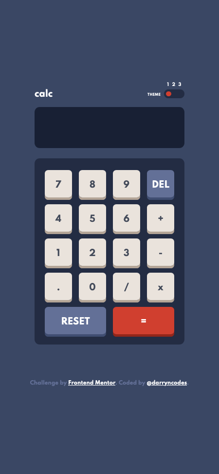
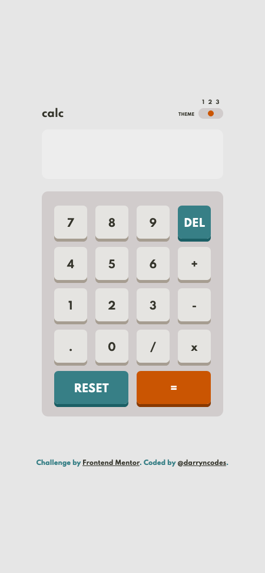
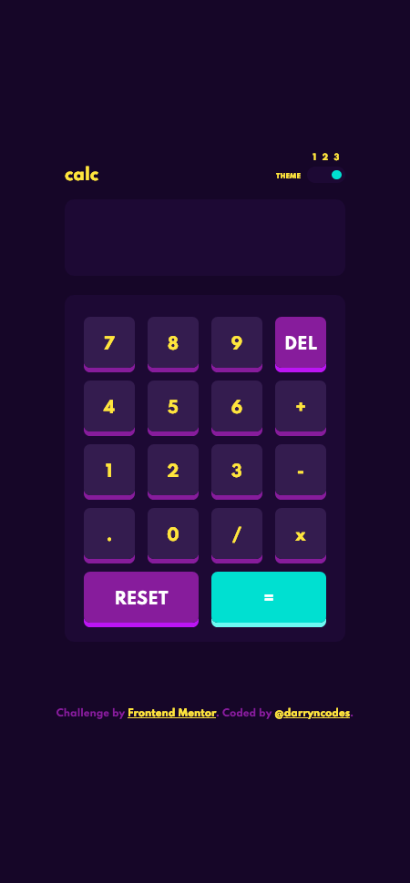

# Frontend Mentor - Calculator app solution

This is a solution to the [Calculator app challenge on Frontend Mentor](https://www.frontendmentor.io/challenges/calculator-app-9lteq5N29). Frontend Mentor challenges help you improve your coding skills by building realistic projects.

## Table of contents

- [Overview](#overview)
  - [The challenge](#the-challenge)
  - [Screenshot](#screenshot)
  - [Links](#links)
- [My process](#my-process)
  - [Built with](#built-with)
  - [What I learned](#what-i-learned)
  - [Useful resources](#useful-resources)
- [Author](#author)

## Overview

### The challenge

Users should be able to:

- See the size of the elements adjust based on their device's screen size
- Perform mathmatical operations like addition, subtraction, multiplication, and division
- Adjust the color theme based on their preference
- **Bonus**: Have their initial theme preference checked using `prefers-color-scheme` and have any additional changes saved in the browser

### Screenshot

### Links

- [GitHub repo](https://github.com/darryncodes/calculator-app)
- [Solution URL](https://darryncodes.github.io/calculator-app/)

## My process

### Built with

- Semantic HTML5 markup
- SCSS
- JS
- Flexbox
- Mobile-first workflow
- BEM methodology
- Parcel

### What I learned

I think this will be one of those project I will look back on fondly and know it was a big milestone.

The three major wins were learning how to work with parcel.js, use modules in JavaScript (albeit not leveraging their full power in this project) and last but not least understanding how to work with local storage.

I used my new knowledge to save the users theme preference so when they return it's just how they left it.

### Useful resources

- [Wes Bos - Modules (Beginner JavaScript notes)](https://wesbos.com/javascript/14-es-modules-and-structuring-larger-apps/78-modules)
- [Wes Bos - Building with Parcel (Beginner JavaScript notes)](https://wesbos.com/javascript/14-es-modules-and-structuring-larger-apps/81-bundling-and-building-with-parcel)
- [Web Dev Simplified - JavaScript Cookies vs Local Storage vs Session](https://www.youtube.com/watch?v=GihQAC1I39Q)
- [Josh W Comeau - Building a Magical 3D Button](https://www.joshwcomeau.com/animation/3d-button/)
- [W3schools - How to animate a button](https://www.w3schools.com/howto/howto_css_animate_buttons.asp)
- [Kevin Powell - prefers-color-scheme](https://www.youtube.com/watch?v=_yCgeXFAXTM)

## Author

- Work in progress portfolio site - [@darryncodes](https://www.darryncodes.co.uk/)
- Frontend Mentor - [@darryncodes](https://www.frontendmentor.io/profile/darryncodes)
- Twitter - [@darryncodes](https://twitter.com/darryncodes)
